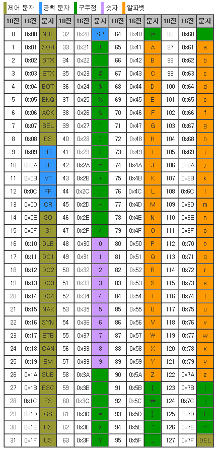

# 네임스페이스
- 개체를 구분할 수 있는 범위. 하나의 네임스페이스는 하나의 개체를 가리킴
- 성격이나 하는 일이 비슷한 클래스, 구조체, 인터페이스, 델리게이트, 열거 형식 등을 하나의 이름 아래 묶음
- 사용법 1
    - 네임스페이스와 클래스명을 모두 붙여줌.
    <details>
    <summary>code</summary>
    
    ```c#
    static void Main(string[] args)
    {
        System.Console.WriteLine();
    }
    ```
    <details>
- 사용법 2
    - `using`을 사용하여 cs파일에서 사용하고자 하는 네임스페이스를 설정
    - 파일 내에서 네임스페이스 없이 직접 클래스를 사용
    <details>
    <summary>code</summary>
    
    ```c#
    using System;

    static void Main(string[] args)
    {
        Console.WriteLine();
    }
    ```

    </details>


# [데이터 형식 구분](Study/DataTypes.md)
1. 메모리 형식에 따른 구분
    - 값 형식(Value Type)
    - 참조 형식(Reference Type)
1. 기본 데이터 형식 (Primitive Type)
    - 숫자 데이터 형식
    - 논리 형식
    - 문자열 형식
    - 오브젝트 형식
2. 상수(Constants)
3. 열거형(Enumerator)
4. 복합 데이터 형식(Complex Data Type)
7. Nullable
8. Var


# 연산자


# 흐름 제어
## 분기문
1. `if`, `else`, `else if`

2. `switch`
    <details>
    <summary>code</summary>  

    ```c#
    switch (조건식)
    {
        case 상수1:
            // 실행 코드
            break;
        case 상수2:
            // 실행 코드
            break:
        default:
            // 어떤 경우와도 맞지 않는 경우
            // default 절은 생략 가능
            break;
    }
    ```
    </details>

## 반복문
1. `while`
2. `do while`
    <details>
    <summary>code</summary>

    ```c#
    do
    {
        // 반복 실행할 코드
    }
    while(조건문);
    ```
    </details>

3. `for`
4. `foreach`
    <details>
    <summary>code</summary>

    ```c#
    foreach(DataType VarName in array 또는 collection)
        // 실행할 코드
    ```
    </details>

## 점프문
1. `break`
2. `continue`
3. `goto`
4. `return`
5. `throw`


# [메소드](Study/Methods.md)
1. 매개 변수
    - 참조에 의한 매개 변수 전달
    - 출력 전용 매개 변수
    - 가변길이 매개 변수
    - 명명된 매개 변수
    - 선택적 매개 변수
2. 메소드 오버로딩

# [클래스](Study/Class.md)
1. 멤버
    - 필드
    - 메소드
    - 프로퍼티
    - 이벤트


# 참고자료
## ASCII Code Table
